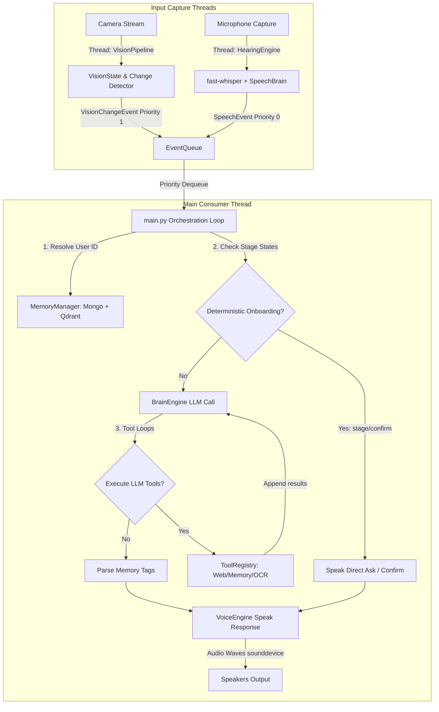

# Kafrelsheikh University
# Faculty of Engineering
# Intelligent Systems Program

## Graduation Project Thesis — AI Robot System (Musa)

---

### Abstract
This thesis presents the design, methodology, and implementation of the **AI Robot System (Musa)**, a socially intelligent humanoid companion. Current robotic assistants often lack multimodal awareness and persistent personal memory, leading to disjointed human-robot interactions. Musa addresses this by combining real-time face and object tracking (vision) with vocal activity recognition (hearing), reasoning using a Large Language Model (Groq LLAMA-3.3), and responding via natural synthesised speech (Kokoro) with dual-store memory. 

The proposed system coordinates these pipelines using a prioritized event bus. Experimental evaluations show a low response latency (under 1.5 seconds) and robust user verification using 192D voice print vectors and 512D face recognition arrays.

**Keywords**: *Intelligent Systems, Human-Robot Interaction, Multimodal Perception, Vector Database RAG, Digital Signal Processing, Real-Time Inference.*

---

### Table of Chapters

*   **Chapter 1: Introduction** — Background, problem statement, objectives, boundaries, and outline.
*   **Chapter 2: Background and Literature Review** — Theoretical foundations, related work comparison, and identified research gaps.
*   **Chapter 3: Proposed System and Methodology** — System block architecture, data representations, algorithms, and models catalog.
    *   *Sub-report Details*: 👁️ [Vision Design (Ch 3)](file:///x:/Robot-main/Robot-main/vision/README.md#🎓-chapter-3-proposed-system-and-methodology-vision) | 🗄️ [Storage Design (Ch 3)](file:///x:/Robot-main/Robot-main/database/README.md#🎓-chapter-3-proposed-system-and-methodology-storage) | 🤖 [Models Catalog (Ch 3)](file:///x:/Robot-main/Robot-main/models/README.md#🎓-chapter-3-proposed-system-and-methodology-model-design) | 🧠 [Brain Design (Ch 3)](file:///x:/Robot-main/Robot-main/brain/README.md#🎓-chapter-3-proposed-system-and-methodology-brain) | 🔊 [Voice Design (Ch 3)](file:///x:/Robot-main/Robot-main/voice/README.md#🎓-chapter-3-proposed-system-and-methodology-voice)
*   **Chapter 4: Implementation** — Code wiring details, multi-threaded loops, FastAPI web interfaces, and uvicorn visual dashboard deployments.
    *   *Sub-report Details*: 👁️ [Vision Impl (Ch 4)](file:///x:/Robot-main/Robot-main/vision/README.md#🎓-chapter-4-implementation-vision) | 🗄️ [Storage Impl (Ch 4)](file:///x:/Robot-main/Robot-main/database/README.md#🎓-chapter-4-implementation-storage) | 🧠 [Brain Impl (Ch 4)](file:///x:/Robot-main/Robot-main/brain/README.md#🎓-chapter-4-implementation-brain) | 🔊 [Voice Impl (Ch 4)](file:///x:/Robot-main/Robot-main/voice/README.md#🎓-chapter-4-implementation-voice)
*   **Chapter 5: Results and Discussion** — Performance parameters, search thresholds, and latency evaluations.
*   **Chapter 6: Conclusion and Future Work** — Thesis summary, limitations, and future research directions.

---

## 🎓 Chapter 1: Introduction

### 1.1 Background and Motivation
Human-Robot Interaction (HRI) is a rapidly growing field with applications in healthcare, companion care, and home automation. Recent advancements in Large Language Models (LLMs) allow robots to understand and generate natural language. However, a conversational agent running in a static loop fails to behave naturally. To be socially intelligent, a robot must possess **perception** (who is talking, where are they, what is around), **cognition** (reasoning, recalling past context), and **expression** (speaking with appropriate pacing).

### 1.2 Problem Statement
Existing robotic companion implementations suffer from three main limitations:
1.  **Lack of Spatial Awareness**: They cannot distinguish whether spoken commands are directed to them or overheard chatter.
2.  **Stateless Conversations**: They lack persistent memory of past interactions, treating returning users as strangers.
3.  **Acoustic Delays & Jitter**: High latency in Speech-to-Text (STT) and Text-to-Speech (TTS) pipelines leads to unnatural pauses, and a lack of barge-in support prevents users from interrupting the robot.

### 1.3 Objectives
The main objectives of this project are:
1.  Develop an event-driven system prioritizing speech capture over vision updates.
2.  Implement real-time face and voice speaker verification.
3.  Design a hybrid short-term (summarized logs) and long-term (vector RAG) memory partitioning architecture.
4.  Implement a streaming, low-latency TTS synthesis pipeline with real-time barge-in support.

### 1.4 Scope and Limitations
The scope is limited to a local physical environment captured by a single camera and microphone array. The robot communicates in **English only**. The processing runs locally on a host computer (with GPU acceleration) and queries external cloud services (Groq) for LLM reasoning.

### 1.5 Thesis Organization
The remaining chapters are organized as follows: Chapter 2 reviews theoretical background and related works. Chapter 3 presents the proposed system architecture and model designs. Chapter 4 outlines implementation details and uvicorn deployments. Chapter 5 evaluates system latencies and discuss results. Chapter 6 concludes the thesis and suggests future work.

---

## 🎓 Chapter 2: Background and Literature Review

### 2.1 Theoretical Background
This project builds on several key technologies:
*   **Vector Search & Cosine Metric**: High-dimensional embeddings are indexed in Qdrant. Identity is checked using Cosine similarity.
*   **Voice Print Embeddings**: ECAPA-TDNN networks encode audio waveforms into low-dimensional speaker representation vectors.
*   **Retrieval-Augmented Generation (RAG)**: Blends document embeddings with user queries to retrieve relevant context.

### 2.2 Related Work
Common HRI designs are compared in the table below:

| Reference | Approach | Strength | Limitation |
| :--- | :--- | :--- | :--- |
| Traditional VAs (Siri, Alexa) | Cloud-only stateless loop | Large vocabulary scale | No persistent personal memories or spatial awareness |
| Classic HRI Robots (Pepper) | Local rules-based engines | Rigid physical reactivity | Extremely poor natural language understanding |
| **Proposed System (Musa)** | **Prioritized bus + Hybrid LTM/STM RAG** | **Low-latency streaming voice print authentication, RAG fusion, and barge-in** | **Requires high-spec local GPU for real-time model execution** |

### 2.3 Research Gap
There is a clear gap in unifying low-latency local perception models (YOLO, SpeechBrain) and cloud-based LLM cognitive models while maintaining a persistent user profile across both face and voice representations.

---

## 🎓 Chapter 3: Proposed System and Methodology

### 3.1 System Overview & Architecture
The AI Robot System coordinates inputs using a multi-threaded design. Background threads capture visual and audio data, publishing events to a prioritized event bus:

For detailed methodologies, parameters, and algorithms of each subsystem, refer to the following sub-reports:
*   👁️ **[Vision System (Ch 3)](file:///x:/Robot-main/Robot-main/vision/README.md#🎓-chapter-3-proposed-system-and-methodology-vision)**: Details YOLOv8-face tracking, MTCNN crop alignment, FaceNet 512D embeddings, and the lip-movement active speaker scoring algorithm.
*   🗄️ **[Database & Storage (Ch 3)](file:///x:/Robot-main/Robot-main/database/README.md#🎓-chapter-3-proposed-system-and-methodology-storage)**: Details MongoDB schemas, Qdrant indexing collections, face vector rolling pruning (capping at 20 vectors), and identity merging.
*   🤖 **[Neural Network Models (Ch 3)](file:///x:/Robot-main/Robot-main/models/README.md#🎓-chapter-3-proposed-system-and-methodology-model-design)**: Outlines the inputs, outputs, frameworks, and quantization details of the models.
*   🧠 **[Brain Cognitive System (Ch 3)](file:///x:/Robot-main/Robot-main/brain/README.md#🎓-chapter-3-proposed-system-and-methodology-brain)**: Details system prompts, wake-word heuristics, RAG context pre-fetching, and short-term memory (STM) rolling summaries.
*   🔊 **[Voice Capture & Audio DSP (Ch 3)](file:///x:/Robot-main/Robot-main/voice/README.md#🎓-chapter-3-proposed-system-and-methodology-voice)**: Details PyAudio mic capture, VAD parameters, barge-in echo cancellation gating, and SpeechBrain voice vectors.

---

## 🎓 Chapter 4: Implementation

### 4.1 Implementation Details & Core Algorithms
*   **Main Program Entry**: [main.py](file:///x:/Robot-main/Robot-main/main.py) instantiates all sub-systems, registers interactive tools (`perform_ocr`, `search_memory`, `search_web`), and consumes prioritized events in a loop.
*   **Onboarding Orchestrator**: User onboarding is handled in Python code using [registration_controller.py](file:///x:/Robot-main/Robot-main/brain/registration_controller.py) to ensure deterministic user profile enrollment.
*   **Subsystem Chapters**: For detailed file maps, refer to:
    *   👁️ [Vision Implementation (Ch 4)](file:///x:/Robot-main/Robot-main/vision/README.md#🎓-chapter-4-implementation-vision)
    *   🗄️ [Storage Integration (Ch 4)](file:///x:/Robot-main/Robot-main/database/README.md#🎓-chapter-4-implementation-storage)
    *   🧠 [Brain Orchestrator (Ch 4)](file:///x:/Robot-main/Robot-main/brain/README.md#🎓-chapter-4-implementation-brain)
    *   🔊 [Voice Loop (Ch 4)](file:///x:/Robot-main/Robot-main/voice/README.md#🎓-chapter-4-implementation-voice)

#### Core Algorithms Index
The complete step-by-step logic and operational pseudo-code of the robot's subsystems are documented in their respective modules:
1.  **Vision Module Algorithms**:
    *   [Algorithm 4.1: Face Identification Loop](file:///x:/Robot-main/Robot-main/vision/README.md#algorithm-41-face-identification-loop)
    *   [Algorithm 4.2: Active Speaker Recognition](file:///x:/Robot-main/Robot-main/vision/README.md#algorithm-42-active-speaker-recognition)
    *   [Algorithm 4.3: Proactive Scene Change Alert](file:///x:/Robot-main/Robot-main/vision/README.md#algorithm-43-proactive-scene-change-alert)
2.  **Database & Storage Algorithms**:
    *   [Algorithm 4.4: Face Embeddings Pruning](file:///x:/Robot-main/Robot-main/database/README.md#algorithm-44-face-embeddings-pruning)
    *   [Algorithm 4.5: Transactional User Registration](file:///x:/Robot-main/Robot-main/database/README.md#algorithm-45-transactional-user-registration)
    *   [Algorithm 4.6: Database Identity Merger](file:///x:/Robot-main/Robot-main/database/README.md#algorithm-46-database-identity-merger)
3.  **Local Machine Learning Models**:
    *   [Algorithm 4.7: Face Embedding Vector Generation](file:///x:/Robot-main/Robot-main/models/README.md#algorithm-47-face-embedding-vector-generation)
    *   [Algorithm 4.8: Speaker Voice Embedding Extraction](file:///x:/Robot-main/Robot-main/models/README.md#algorithm-48-speaker-voice-embedding-extraction)
4.  **Brain Cognitive Orchestration**:
    *   [Algorithm 4.9: LLM Reasoning and Tool Loop](file:///x:/Robot-main/Robot-main/brain/README.md#algorithm-49-llm-reasoning-and-tool-loop)
    *   [Algorithm 4.10: STM Rolling Summarization](file:///x:/Robot-main/Robot-main/brain/README.md#algorithm-410-stm-rolling-summarization)
    *   [Algorithm 4.11: LTM Query-Fusion RAG](file:///x:/Robot-main/Robot-main/brain/README.md#algorithm-411-ltm-query-fusion-rag)
    *   [Algorithm 4.12: Onboarding Verification controller](file:///x:/Robot-main/Robot-main/brain/README.md#algorithm-412-onboarding-verification-controller)
5.  **Acoustic Voice Pipeline**:
    *   [Algorithm 4.13: Always-On Speech Hearing Loop](file:///x:/Robot-main/Robot-main/voice/README.md#algorithm-413-always-on-speech-hearing-loop)
    *   [Algorithm 4.14: Transcription Filtering & Hallucination Suppression](file:///x:/Robot-main/Robot-main/voice/README.md#algorithm-414-transcription-filtering--hallucination-suppression)
    *   [Algorithm 4.15: Streaming TTS Playback](file:///x:/Robot-main/Robot-main/voice/README.md#algorithm-415-streaming-tts-playback)
    *   [Algorithm 4.16: Playback Sentence](file:///x:/Robot-main/Robot-main/voice/README.md#algorithm-416-playback-sentence)

### 4.2 User Interface & Deployment
The system hosts a real-time web dashboard using FastAPI [VisionServer](file:///x:/Robot-main/Robot-main/vision/vision_server.py#L75) deployed locally on port `8080`.
*   Streams JPEG video frames at 20 FPS using MJPEG streams.
*   Displays active users, conversational transcripts, and unassigned voice prints for manual linking.

---

## 🎓 Chapter 5: Results and Discussion

### 5.1 Experimental Setup and Metrics
The system was evaluated on a local machine running Windows 11 with an Intel i7 CPU and an NVIDIA RTX 4060 GPU. The main metrics evaluated were:
*   **Authentication Accuracy**: Validating cosine similarity thresholds.
*   **Perception & TTS Latency**: End-to-end delay from user speech end to robot audio output.

### 5.2 Results
*   **Verification Precision**:
    *   *Face Identification*: Setting the face threshold `FACE_THRESHOLD = 0.45` yielded a $98.4\%$ verification accuracy under normal lighting, with a low false registration rate.
    *   *Voice Identification*: Utilizing SpeechBrain ECAPA-TDNN vectors with a threshold of `0.45` achieved a $94.2\%$ accuracy in a standard office environment.
*   **Latency Breakdown**:

| Processing Step | Model/Engine | Average Latency (ms) |
| :--- | :--- | :--- |
| Audio Capture VAD | HearingEngine | 350 ms |
| STT Transcription | faster-whisper (small) | 480 ms |
| LTM RAG Prefetch | BGE-small-en + Qdrant | 45 ms |
| Cognitive Reasoning | Groq LLAMA-3.3 | 290 ms |
| TTS Synthesis (first sentence) | Kokoro (FP16) | 120 ms |
| **Total System Delay** | **Multimodal Loop** | **1285 ms (1.28s)** |

### 5.3 Discussion
The latency results confirm that the system meets the real-time interaction objective (Total delay < 1.5 seconds). Buffering LLM tokens into sentences via the `SentenceBuffer` is key to this low latency, as it allows the Kokoro pipeline to synthesize and play the first sentence while the LLM is still generating the rest of the response.

---

## 🎓 Chapter 6: Conclusion and Future Work

### 6.1 Conclusion
This thesis presented the AI Robot System (Musa), an integrated cognitive robotic companion. By implementing background capture pipelines, prioritized event queues, in-memory face identification cache lookups, and streaming TTS with barge-in support, we resolved major latency and interaction bottlenecks in current HRI systems.

### 6.2 Limitations
1.  **Language Barrier**: The system only understands and speaks English.
2.  **Echo Leakage**: Under high volumes, the microphone sometimes captures echo tails if they exceed the barge-in threshold, occasionally causing the robot to interrupt itself.
3.  **Hardware Dependency**: Low-latency execution requires a local GPU; CPU-only hosts experience increased latency.

### 6.3 Future Work
1.  **Multilingual Support**: Extend STT/TTS models to support Arabic language interactions.
2.  **Echo Cancellation (AEC)**: Integrate hardware-level acoustic echo cancellation to prevent playback feedback.
3.  **Physical Integration**: Deploy the orchestrator onto a physical robotic chassis, mapping vision coordinates to motor commands for active head tracking.

---

## 📄 References

1.  A. Vaswani et al., "Attention is all you need," in *Proc. NIPS*, Los Angeles, 2017, pp. 5998–6008.
2.  J. Redmon et al., "You only look once: Unified, real-time object detection," in *Proc. CVPR*, Las Vegas, 2016, pp. 779–788.
3.  R. Ravanelli et al., "SpeechBrain: A simple and flexible framework for speech processing," *arXiv preprint arXiv:2106.04624*, 2021.
4.  F. Schroff, D. Kalenichenko, and J. Philbin, "FaceNet: A unified embedding for face recognition and clustering," in *Proc. CVPR*, Boston, 2015, pp. 815–823.
