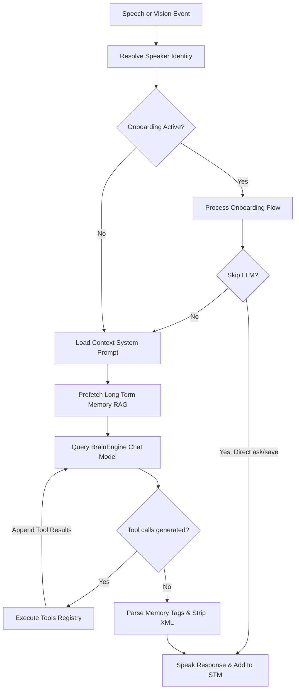
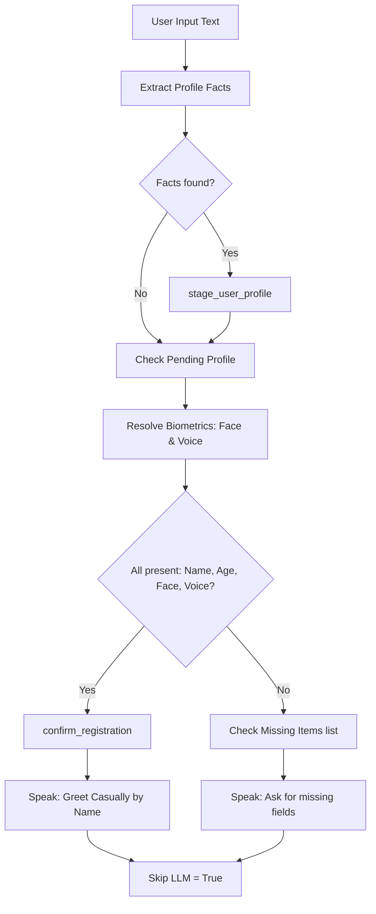
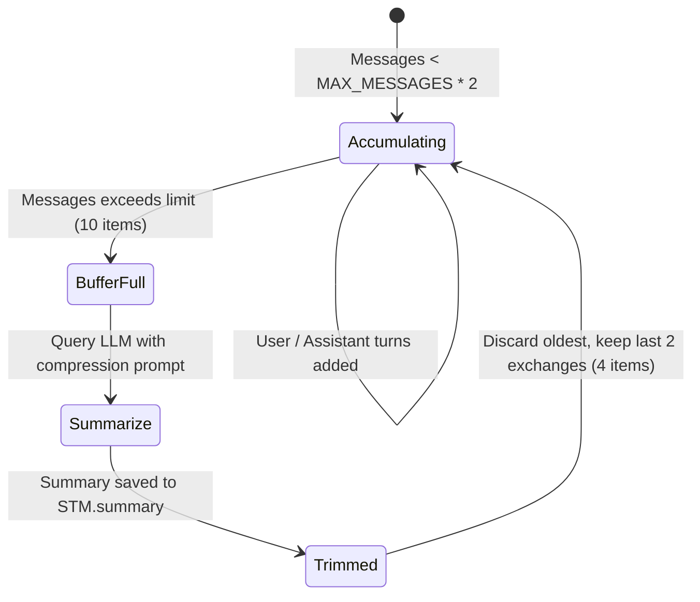

# 🧠 Brain Thesis Report (Chapters 3 & 4)

This document serves as the **Cognitive Brain Subsystem Report** for the AI Robot System, formatted in accordance with the Graduation Project Thesis Guide guidelines. It details the system prompts, conversational reasoning structures, session lifecycles, and tool registries.

---

## 📂 File Structure & Code Map

*   [llm_engine.py](file:///x:/Robot-main/Robot-main/brain/llm_engine.py) — Core LLM reasoning loop, tool executor, and fallback parser.
*   [session_manager.py](file:///x:/Robot-main/Robot-main/brain/session_manager.py) — Conversation session managers, inactivity timer loops, and biometric capture caches.
*   [registration_controller.py](file:///x:/Robot-main/Robot-main/brain/registration_controller.py) — Enrolls user profiles and handles confirmation logic.
*   [prompts.py](file:///x:/Robot-main/Robot-main/brain/prompts.py) — Holds baseline system prompts.
*   [addressing.py](file:///x:/Robot-main/Robot-main/brain/addressing.py) — Directedness evaluator and wake-word parser.
*   [profile_extract.py](file:///x:/Robot-main/Robot-main/brain/profile_extract.py) — Extracts profile facts from conversations using LLM.
*   [memory/](file:///x:/Robot-main/Robot-main/brain/memory) — Memory structures:
    *   [stm.py](file:///x:/Robot-main/Robot-main/brain/memory/stm.py) — Short-term dialog context buffer and rolling summarizer.
    *   [ltm.py](file:///x:/Robot-main/Robot-main/brain/memory/ltm.py) — RAG search and query-fusion models.
*   [tools/](file:///x:/Robot-main/Robot-main/brain/tools) — LLM interactive tools:
    *   [tool_registry.py](file:///x:/Robot-main/Robot-main/brain/tools/tool_registry.py) — Function schema mapper.
    *   [crud_tool.py](file:///x:/Robot-main/Robot-main/brain/tools/crud_tool.py) — Stages and updates MongoDB profiles.
    *   [ocr_tool.py](file:///x:/Robot-main/Robot-main/brain/tools/ocr_tool.py) — EasyOCR text reader.
    *   [rag_tool.py](file:///x:/Robot-main/Robot-main/brain/tools/rag_tool.py) — Vector memory queries.
    *   [stm_tool.py](file:///x:/Robot-main/Robot-main/brain/tools/stm_tool.py) — Dialog history lookups.
    *   [web_search_tool.py](file:///x:/Robot-main/Robot-main/brain/tools/web_search_tool.py) — DuckDuckGo web search wrapper.

---

## 🎓 Chapter 3: Proposed System and Methodology (Brain)

### 3.1 Brain Overview & Architecture
The Brain module acts as the robot's central processing hub, orchestrating perception data and deciding on conversational or tool actions.



*   **System Prompt Configuration**: [prompts.py](file:///x:/Robot-main/Robot-main/brain/prompts.py) defines the robot's identity as "Musa", sets English-only communication constraints, maps profile attributes, and declares rules for camera visual references.
*   **Speech Directedness Heuristic**: The [addressing.py](file:///x:/Robot-main/Robot-main/brain/addressing.py) module calculates whether speech was directed to the robot or overheard. It scans for wake words (`musa`, `hey musa`). If not found, it flags the speech as overheard, instructing the LLM to remain silent or respond with a short clause.

### 3.3 Methodology & Cognitive Logic

#### A. User Onboarding Flow
Onboarding checks for four required fields: name, age, face embedding, and voice embedding:
*   [extract_profile_facts](file:///x:/Robot-main/Robot-main/brain/profile_extract.py#L12) extracts fields from speech using the LLM.
*   `process_registration_turn` stages facts via `stage_user_profile`. If all four fields are resolved, the system auto-confirms the profile and registers it in the DB, bypassing LLM generation (`skip_llm = True`).



#### B. Short-Term Memory (STM) Rolling Summarization
STM stores dialogue turns. When the queue size exceeds `STM_MAX_MESSAGES * 2`, the engine summarizes the history:
1.  **Summarize Call**: Queries the LLM to compress the entire history into a single paragraph.
2.  **Trimming**: Saves the summary to `STM.summary` and clears the dialogue log except for the last 2 exchanges (4 messages) to preserve immediate context.



#### C. Long-Term Memory (LTM) Query Fusion
Retrieval blends user profile context with the search query to improve pronoun and entity recall:
$$\text{Blended Search Vector} = \frac{\text{Embedding}(\text{Query}) + \text{Embedding}(\text{Profile} + \text{Query})}{2}$$

### 3.4 Tools and Technologies (Brain)
*   **Cognitive Framework**: LangChain-core (message models and ChatModel bindings).
*   **LLM API**: Groq Cloud REST APIs (accessing `llama-3.3-70b-versatile`).
*   **Embeddings Model**: Sentence-Transformers (loading `BAAI/bge-small-en-v1.5` on CUDA/CPU).

---

## 🎓 Chapter 4: Implementation (Brain)

### 4.1 Detailed Algorithmic Logic

Here we detail the step-by-step algorithms governing the Brain Module's subsystems.

#### Algorithm 4.9: LLM Reasoning and Tool Loop
```
INPUT: User speech text, latest_scene, stm_history, user_profile
OUTPUT: Spoken response text

1. Compile Prompt:
   a. Retrieve pre-fetched LTM snippets for query (using Algorithm 4.11).
   b. Assess speech directedness (wake words, centrality metrics).
   c. Call _build_messages; returns system message, rolling summary, and dialog list.
   
2. Query Model:
   a. Send messages to Groq LLM API.
   b. Let ai_msg be the output response.
   c. Let tool_rounds = 0.
   d. Set max_tool_rounds = 4.
   
3. Loop for Tools execution:
   While tool_rounds < max_tool_rounds:
     a. Extract tool calls from ai_msg.tool_calls.
     b. If no native calls are found but content contains "<function=X>...</function>":
          Extract function name and arguments via regex manual fallback.
     c. If no tools extracted, break loop.
     d. Push ai_msg to prompt messages list.
     e. Set tool_rounds = tool_rounds + 1.
     f. For each extracted tool_call = (Name, Args, ID):
          i. Call ToolRegistry.execute(tool_call).
         ii. If tool execution throws an API 400 bad request containing 'failed_generation':
               a. Parse and extract preceding clean conversational string.
               b. Reconstruct tool parameters and run function (failed generation recovery).
        iii. Construct ToolMessage containing string representation of the output.
         iv. Push ToolMessage to prompt messages list.
     g. Call Groq API with updated prompt; update ai_msg.
     
4. Finalize Spoken Response:
   a. Let full_response = ai_msg.content.
   b. If full_response contains '<save_to_memory summary="FACT" />':
        i. Extract FACT string.
       ii. Flag save_to_memory = True.
      iii. Strip tag from full_response text.
   c. Return cleaned full_response.
```

#### Algorithm 4.10: STM Rolling Summarization
```
INPUT: user_text, assistant_response
OUTPUT: None (Updates ShortTermMemory state)

1. Append user_text and assistant_response to messages list queue.
2. Let N = length of messages list queue.
3. If N > 10 (STM_MAX_MESSAGES * 2):
     a. Construct lines = concatenation of all turns in messages list.
     b. Build compression prompt:
        "Summarize conversation... Previous summary: {self.summary}... turns: {lines}"
     c. Call ChatModel.invoke(compression prompt); returns text summary response.
     d. Set self.summary = text summary response.
     e. Slice messages list: messages = messages[-4:] (keep last 2 exchanges).
```

#### Algorithm 4.11: LTM Query-Fusion RAG
```
INPUT: search_query string, user_id string, user_profile_hint string, top_k integer
OUTPUT: List of matching memory snippets

1. Embed raw query:
   a. Let vec_q = SentenceTransformer.encode(search_query).
   b. Add vec_q to candidate search list.
   
2. Apply Profile Query Fusion:
   a. If user_profile_hint is present and length > 8:
        i. Construct blended_text = "Profile: {user_profile_hint}\nTopic: {search_query}".
       ii. Let vec_b = SentenceTransformer.encode(blended_text).
      iii. Compute fused vector = (vec_q + vec_b) / 2.
       iv. Add fused vector to candidate search list.
       
3. Execute Vector Search:
   a. Initialize hit_scores dictionary, hit_details dictionary.
   b. For each vector V in candidate search list:
        i. Call QdrantManager.search_memory passing V, top_k, and user_id filter.
       ii. For each hit point in results (point ID, score, payload):
             If score > hit_scores[point ID]:
               hit_scores[point ID] = score, hit_details[point ID] = hit point.
               
4. Format output:
   a. Sort hit_details by score reverse.
   b. Return top_k matching memory text lines containing timestamps.
```

#### Algorithm 4.12: Onboarding Verification controller
```
INPUT: user_spoken_text, voice_embedding_present status
OUTPUT: RegistrationTurnResult object

1. Call LLM fact extraction:
   a. Parse user_spoken_text to identify if name or age were introduced.
   b. Let facts = extracted JSON structure (name, age).
   
2. Check confirm/deny parameters:
   a. If user_spoken_text signifies a denial:
        i. Clear session pending registration memory.
       ii. Return Result(speak_text="No problem - tell me your correct details", skip_llm=True).
       
3. Stage facts:
   a. If facts contain new data:
        i. Update session.pending_profile with facts.
        
4. Assess completeness:
   a. Let profile = session.pending_profile.
   b. Let bio = session.biometric_capture (stashed face/voice vectors).
   c. Let missing = []
   d. If profile.name is empty or "Unknown", add "name" to missing.
   e. If profile.age is empty, add "age" to missing.
   f. If bio.face_embedding is empty, add "face" to missing.
   g. If bio.voice_embedding is empty and voice_embedding_present is false, add "voice" to missing.
   
5. Process Action Gate:
   a. If missing list is empty (All items completed):
        i. Call MemoryManager.register_user(profile.name, bio.face_embedding).
       ii. Call MemoryManager.register_voice(user_id, bio.voice_embedding).
      iii. Return Result(confirmed=True, speak_text="Nice to meet you, [Name]!", skip_llm=True).
   b. If missing list is not empty:
        i. Return Result(missing=missing, speak_text=ask_for_missing(missing), skip_llm=True).
```

---

### 4.2 Session Management Details
*   The [SessionManager](file:///x:/Robot-main/Robot-main/brain/session_manager.py#L18) runs a countdown timer. Inactivity for `SESSION_TIMEOUT_SECONDS` (default: 60s) triggers `_end_session_locked`, which summarizes the dialog and saves it to Qdrant.
