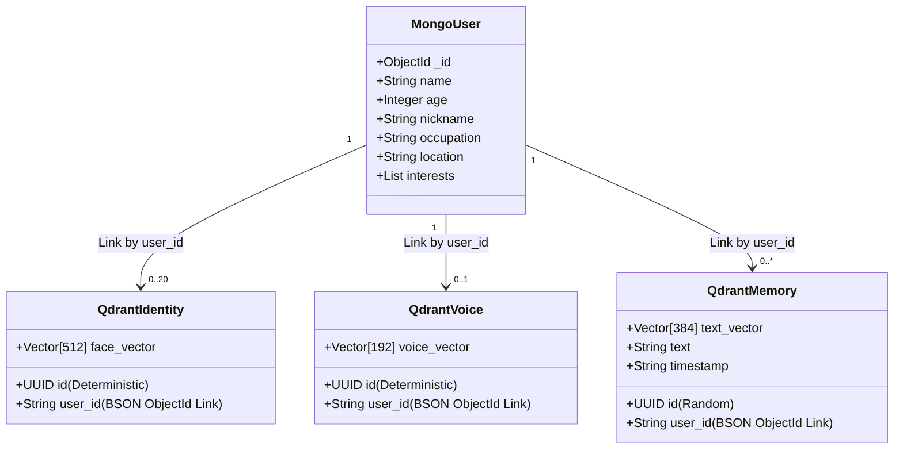
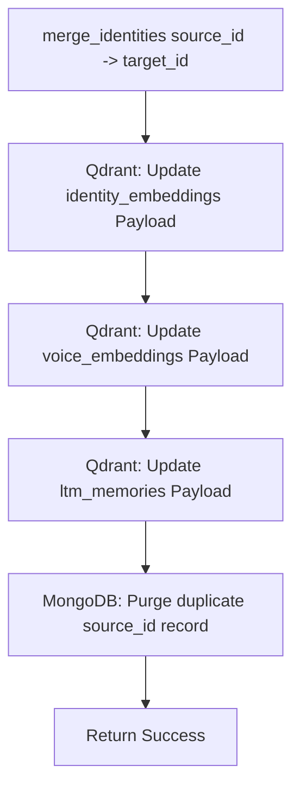

# 🗄️ Database & Storage Thesis Report (Chapters 3 & 4)

This document serves as the **Database & Storage Subsystem Report** for the AI Robot System, formatted in accordance with the Graduation Project Thesis Guide guidelines. It details the design, entity mapping models, and implementation details of the hybrid data layer.

---

## 📂 File Structure & Code Map

*   [mongo_manager.py](file:///x:/Robot-main/Robot-main/database/mongo_manager.py) — BSON serializations and user profile collections CRUD.
*   [qdrant_manager.py](file:///x:/Robot-main/Robot-main/database/qdrant_manager.py) — Vector collections, cosine similarity search indices, and pruning triggers.
*   [memory_manager.py](file:///x:/Robot-main/Robot-main/database/memory_manager.py) — The transactional bridge linking MongoDB documents and Qdrant embeddings.

---

## 🎓 Chapter 3: Proposed System and Methodology (Storage)

### 3.1 Storage Overview & Architecture
The storage sub-system maps unstructured files and relational data entities using a hybrid document-vector mapping schema. MongoDB stores structured profile metadata, while Qdrant stores high-dimensional vector representations.



### 3.3 Methodology

#### A. Multi-Vector Rolling Pruning Algorithm
To adapt to varying camera angles and lighting conditions, the vision thread dynamically uploads high-confidence face embeddings to Qdrant. To prevent search degradation and database bloat, the Qdrant manager implements a rolling pruning algorithm:
*   **Vector Cap**: Face vectors are limited to a maximum of $20$ per user (`_MAX_FACE_EMBEDDINGS_PER_USER`).
*   **Pruning Logic**: On every insert, the database checks the user's vector count. If it exceeds the cap, it sorts vector UUIDs and deletes the oldest ones first.

#### B. Voice Similarity Thresholding
A cosine similarity threshold is configured for voice matching to recognize speakers in noisy environments:
*   **Cos-Sim Metric**: Cosine Similarity measures the angle between signal embeddings.
*   **Threshold Value**: Voice cosine similarity threshold is set to `0.45` to minimize false negatives under ambient background noise.

#### C. Identity Merging Methodology
If a user is initially tracked as "Unknown" (generating a staged profile and temporary ID) and later identified as a registered user, the system unifies records:
1.  **Payload Migration**: Updates the metadata payloads in Qdrant collections (`identity_embeddings`, `voice_embeddings`, `ltm_memories`) mapping them to the target user ID.
2.  **Purge Trigger**: Purges the redundant source profile from MongoDB.



### 3.4 Tools and Technologies (Storage)
*   **MongoDB**: Document-based metadata storage database (v6.0+).
*   **Qdrant**: Vector Similarity Search Engine engine (v1.17+).
*   **Client Libraries**: Pymongo (Mongo interactions) and Qdrant-Client (gRPC/REST vector interactions).

---

## 🎓 Chapter 4: Implementation (Storage)

### 4.1 Detailed Algorithmic Logic

Here we detail the step-by-step algorithms governing the Storage Module's subsystems.

#### Algorithm 4.4: Face Embeddings Pruning
```
INPUT: user_id string
OUTPUT: None (Deletes outdated points in Qdrant)

1. Perform scroll query on COLLECTION_IDENTITY collection:
   a. Apply Scroll Filter: Match payload field 'user_id' == user_id.
   b. Exclude vector dimensions (retrieve point IDs and payloads only).
   c. Retrieve up to 200 matching points.
   
2. Evaluate Cap:
   a. Let point_list be the list of retrieved points.
   b. Let N = size(point_list).
   c. If N > 20 (_MAX_FACE_EMBEDDINGS_PER_USER):
        i. Sort point_list alphabetically by point UUID string representation.
       ii. Let delete_count = N - 20.
      iii. Slice list: points_to_delete = point_list[0 : delete_count].
       iv. Call Qdrant.delete endpoint passing points_to_delete list selector.
```

#### Algorithm 4.5: Transactional User Registration
```
INPUT: user_name string, face_embedding vector, optional profile attributes
OUTPUT: user_id string

1. Check MongoDB for existing registration:
   a. Query collection 'users' where 'name' == user_name.
   b. If profile is returned:
        i. Extract user_id = profile['_id'].
       ii. Print update log message.
      Else:
        i. Create document doc = {'name': user_name, **profile attributes}.
       ii. Call MongoDB.insert_one(doc); returns new BSON ObjectId.
      iii. Set user_id = String(ObjectId).
      iv. Print registration log message.
      
2. Index Face Embedding in Vector DB:
   a. Generate random UUIDv4 string = point_id.
   b. Construct payload = {'user_id': user_id}.
   c. Call QdrantManager.store_embedding:
        i. Target collection: 'identity_embeddings'.
       ii. Pass point_id, face_embedding, and payload.
   
3. Prune Old Vectors:
   a. Call Algorithm 4.4 (Face Embeddings Pruning) passing user_id.
   
4. Return user_id string.
```

#### Algorithm 4.6: Database Identity Merger
```
INPUT: source_id string, target_id string
OUTPUT: Boolean success status

1. Consolidate Qdrant Face Vectors:
   a. Call Qdrant.set_payload:
        i. Target collection: 'identity_embeddings'.
       ii. Search Filter: Match payload 'user_id' == source_id.
      iii. Set Payload field: 'user_id' = target_id.
      
2. Consolidate Qdrant Voice Signatures:
   a. Call Qdrant.set_payload:
        i. Target collection: 'voice_embeddings'.
       ii. Search Filter: Match payload 'user_id' == source_id.
      iii. Set Payload field: 'user_id' = target_id.
      
3. Consolidate Qdrant Long-Term Memories:
   a. Call Qdrant.set_payload:
        i. Target collection: 'ltm_memories'.
       ii. Search Filter: Match payload 'user_id' == source_id.
      iii. Set Payload field: 'user_id' = target_id.
      
4. Clean Profile Document:
   a. Query MongoDB: delete_one in 'users' collection where '_id' == source_id.
   
5. Print completion status log and return True.
```

---

### 4.2 User Interface & Deployment (FastAPI)
The [VisionServer](file:///x:/Robot-main/Robot-main/vision/vision_server.py#L75) exposes endpoints:
*   `GET /`: Serves the dashboard page ([dashboard.html](file:///x:/Robot-main/Robot-main/vision/templates/dashboard.html)) containing real-time stream feeds.
*   `GET /video_feed`: Streams MJPEG frames at 20 FPS using the `multipart/x-mixed-replace` MIME type boundary.
*   `GET /status` / `GET /session_status`: Exposes `VisionState` JSON properties.
*   `POST /api/assign_voice`: Commits unassigned voice embeddings to MongoDB user documents.
