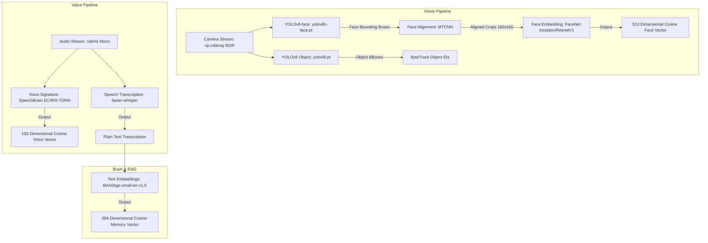

# 🤖 Model Design Thesis Report (Chapter 3)

This document serves as the **Neural Network & Model Design Report** for the AI Robot System, formatted in accordance with the Graduation Project Thesis Guide guidelines. It details the dataset characteristics, model choices, hyper-parameters, and execution strategies.

---

## 🏗️ Neural Network Model Architecture & Vectors

The diagram below details the operational input sources, localized machine learning models, and their resulting feature representations:



---

## 🎓 Chapter 3: Proposed System and Methodology (Model Design)

### 3.2 Dataset & Local Models Catalog

The robot executes machine learning models locally on the host machine. The directory contains the following pre-trained models:

| File / Folder Name | Framework | Description | Input Format | Output Format |
| :--- | :--- | :--- | :--- | :--- |
| `yolov8n-face.pt` | PyTorch | YOLOv8 Face detection model. | BGR Image ($640 \times 480 \times 3$) | BBox coordinates + confidence score |
| `yolov8l.pt` | PyTorch | YOLOv8 object detection model. | BGR Image ($640 \times 480 \times 3$) | BBox coordinates + class ID + confidence |
| `yolov8n.pt` | PyTorch | YOLOv8 object detection model. | BGR Image ($640 \times 480 \times 3$) | BBox coordinates + class ID + confidence |
| `mobilefacenet_scripted.pt` | PyTorch | Scripted MobileFaceNet model. | Aligned Face Crop ($112 \times 112 \times 3$) | 128-dimensional embedding vector |
| `spkrec-ecapa-voxceleb` | SpeechBrain | ECAPA-TDNN speaker recognition. | Audio Waveform ($16\text{kHz}$ Mono, $\geq 0.75\text{s}$) | 192-dimensional voice embedding vector |

---

## 🎓 Chapter 4: Implementation (Models)

### 4.1 Detailed Algorithmic Logic

Here we detail the step-by-step algorithms governing the Model Subsystem's pipelines.

#### Algorithm 4.7: Face Embedding Vector Generation
```
INPUT: Raw camera frame BGR image, bounding box B = (x1, y1, x2, y2)
OUTPUT: Normalized 512-dimensional face vector (or None)

1. Adjust margins and crop face region:
   a. Compute margin = 30 pixels.
   b. Set x1_m = max(0, x1 - margin), y1_m = max(0, y1 - margin).
   c. Set x2_m = min(Frame Width, x2 + margin), y2_m = min(Frame Height, y2 + margin).
   d. Extract crop = frame[y1_m : y2_m, x1_m : x2_m].
   e. If crop is empty, return None.
   
2. Align Face:
   a. Convert crop from BGR to RGB color space.
   b. Pass RGB crop to MTCNN pipeline.
   c. If MTCNN fails to locate landmark keypoints, return None.
   d. Else, MTCNN returns aligned 160x160x3 normalized tensor T.
   
3. Extract Embeddings:
   a. Push tensor T to target device (GPU or CPU).
   b. Add batch dimension: T_batch = Unsqueeze(T, 0).
   c. Run FaceNet InceptionResnetV1 model in evaluation mode:
        Raw_Embedding = FaceNet(T_batch)[0].
        
4. L2 Normalization:
   a. Normalize the raw embedding vector:
        Norm_Embedding = Raw_Embedding / L2_Norm(Raw_Embedding).
   b. Return Norm_Embedding.
```

#### Algorithm 4.8: Speaker Voice Embedding Extraction
```
INPUT: 1D audio waveform array (sampled at 16kHz)
OUTPUT: 192-dimensional voice print vector (or None)

1. Validate input length:
   a. Let L = length of audio array.
   b. Compute duration = L / 16000.
   c. If duration < VOICE_EMBEDDING_MIN_SECONDS (0.75s), return None.
   
2. Process Tensor:
   a. Convert audio array to float32 PyTorch tensor.
   b. Add batch dimension: signal = Unsqueeze(tensor, 0).
   c. Push signal to target device.
   
3. Inference SpeechBrain ECAPA model:
   a. Run model: Raw_Embeddings = EncoderClassifier.encode_batch(signal).
   b. Squeeze batch dimensions and convert to numpy array: Output_Vec = Squeeze(Raw_Embeddings).
   
4. Return Output_Vec numpy array.
```

---

## 🎓 Chapter 3: Proposed System and Methodology (Model Design - Continued)

### 3.3 Methodology & Model Design

#### A. Model Selection Rationale
*   **Face Detection**: YOLOv8-face (`yolov8n-face.pt`) is chosen over standard Haar Cascades due to its robustness under partial occlusions, rotations, and changing illumination conditions.
*   **Face Embeddings**: FaceNet (`InceptionResnetV1`) pre-trained on `vggface2` is selected for its high classification accuracy. It outputs a normalized $512$-dimensional vector optimized for cosine similarity comparisons.
*   **Object Tracking**: YOLOv8l (`yolov8l.pt`) combined with ByteTrack provides stable temporal tracking across frames, which is critical for maintaining consistent object identifiers.
*   **Voice Verification**: SpeechBrain's ECAPA-TDNN trained on VoxCeleb is chosen for its robustness under ambient room acoustics. It generates a 192D embedding from audio signal frames.

#### B. Execution & Quantization Strategy
Models are dynamically loaded onto computing resources based on `ROBOT_DEVICE` configurations (CUDA or CPU):
*   **GPU Acceleration**: PyTorch calls utilize CUDA cores to speed up FaceNet alignment and YOLO tracking.
*   **CPU Fallback & Quantization**: If running on CPU, model computations are quantized (e.g. `int8` quantization for Whisper and FP16 for Kokoro pipelines) to keep latency low.
