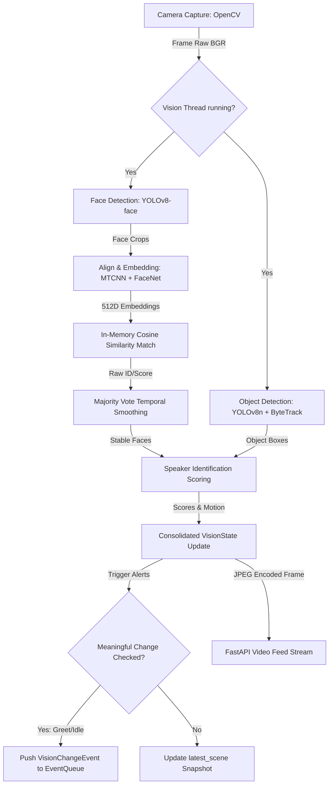
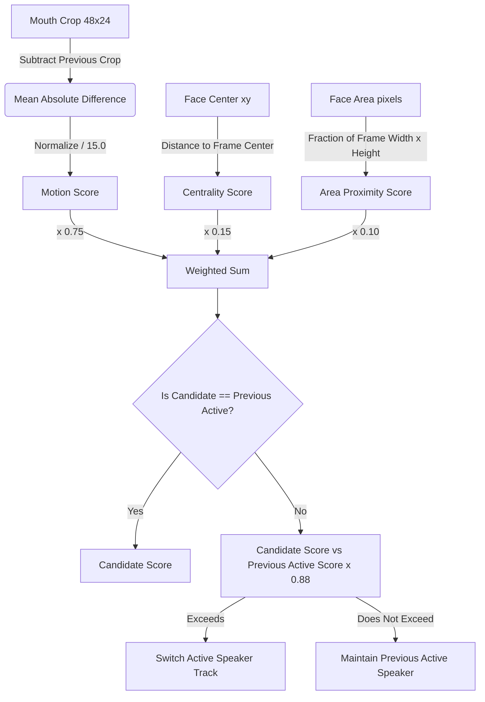

# 👁️ Vision Thesis Report (Chapters 3 & 4)

This document serves as the **Vision Subsystem Report** for the AI Robot System, formatted in accordance with the Graduation Project Thesis Guide guidelines. It details the design, mathematical models, and implementation details of the vision perception pipelines.

---

## 📂 File Structure & Code Map

*   [vision_pipeline.py](file:///x:/Robot-main/Robot-main/vision/vision_pipeline.py) — Threaded perception loop and proactive change detector.
*   [face_recognition.py](file:///x:/Robot-main/Robot-main/vision/face_recognition.py) — YOLOv8-face trackers, MTCNN aligners, FaceNet embedding generator, and FER analyzers.
*   [object_recognition.py](file:///x:/Robot-main/Robot-main/vision/object_recognition.py) — YOLOv8n object classification and ByteTrack tracking.
*   [speaker_identifier.py](file:///x:/Robot-main/Robot-main/vision/speaker_identifier.py) — Lip-motion scoring heuristics and temporal stickiness estimators.
*   [vision_server.py](file:///x:/Robot-main/Robot-main/vision/vision_server.py) — FastAPI hosting visual streams and user identification API endpoints.

---

## 🎓 Chapter 3: Proposed System and Methodology (Vision)

### 3.1 Vision Architecture & Data Flow
The vision pipeline is designed to process video frames concurrently. It is executed on an independent thread ([VisionPipeline](file:///x:/Robot-main/Robot-main/vision/vision_pipeline.py#L148)) to isolate inference processing from voice interaction (STT/TTS).



### 3.3 Methodology & Model Design

#### A. Face Recognition and Identification
Human identification combines spatial filters, feature extractors, and temporal filters to prevent identity flicker:
1.  **Spatial Filtering**: YOLOv8-face outputs are filtered by face area ($Area \geq 0.05 \times \text{Frame Area}$), aspect ratio ($0.6 \leq \frac{Width}{Height} \leq 1.7$), and boundary proximity (cutoffs at edges are rejected) to prevent tracking artifacts.
2.  **Feature Extraction**: Faces are aligned via MTCNN to a $160 \times 160$ crop. FaceNet (InceptionResnetV1) generates a normalized $512$-dimensional vector.
3.  **Cosine Similarity Match**: Cosine similarity is computed against local cache vectors. Match index:
    $$\text{Similarity}(A, B) = \frac{A \cdot B}{\|A\| \|B\|}$$
    Matches exceeding `FACE_THRESHOLD` (default: `0.45`) are stashed in a sliding deque (`FACE_SIM_HISTORY = 5`). A majority vote yields the finalized user ID.

#### B. Active Speaker Identification
Active speaker selection gauges lip movements, frame centrality, and visual proximity:
*   **Mouth Region Crop**: Extracts the lower 35% of the face bounding box and downsamples it to $48 \times 24$ pixels.
*   **Motion Estimation**: Evaluates the Mean Absolute Difference (MAD) against the mouth crop from the previous frame:
    $$\text{Motion} = \frac{1}{N} \sum_{i=1}^{N} |I_{t}(i) - I_{t-1}(i)|$$
*   **Weighted Scoring Model**:
    $$\text{Score} = 0.75 \times \text{Motion} + 0.15 \times \text{Centrality} + 0.10 \times \text{Face Area}$$
*   **Jitter Protection (Stickiness)**: Applies a stickiness ratio multiplier ($0.88$) to candidate scores. A speaker transition occurs only if:
    $$\text{Score}_{\text{new}} \geq \frac{\text{Score}_{\text{active}}}{0.88}$$



### 3.4 Tools and Technologies (Vision)
*   **Programming Language**: Python 3.10+
*   **Frameworks & Libraries**: OpenCV (video capture and encoding), PyTorch (MTCNN & FaceNet running on CUDA/CPU), Ultralytics (YOLOv8 tracking and ByteTrack support), FER (facial expression analysis), and FastAPI (Uvicorn REST hosting).
*   **Hardware Setup**: CUDA 12.1 compatible NVIDIA GPU for low-latency embeddings inference.

---

## 🎓 Chapter 4: Implementation (Vision)

### 4.1 Detailed Algorithmic Logic

Here we detail the step-by-step algorithms governing the Vision Module's subsystems.

#### Algorithm 4.1: Face Identification Loop
```
INPUT: Raw camera video frame (BGR)
OUTPUT: List of detected FaceInfo objects containing identified user IDs

1. Call YOLOv8-face tracker to locate face coordinates:
   For each detected bounding box B = (x1, y1, x2, y2) and ByteTrack ID:
     a. Compute Width = x2 - x1 and Height = y2 - y1.
     b. Compute Aspect Ratio = Width / Height.
     c. If Aspect Ratio < 0.6 or Aspect Ratio > 1.7, discard (noise filter).
     d. If bounding box touches borders, discard (partial edge crop filter).
     e. If B passes filters, proceed.
     
2. Align and Extract Feature Embedding:
   a. Crop B from frame and convert from BGR to RGB.
   b. Feed crop to MTCNN helper; returns aligned 160x160 tensor.
   c. Feed tensor to FaceNet model; outputs normalized 512D vector E.
   
3. Query Local In-Memory Cache:
   a. Initialize best_similarity = -1.0, matched_user_id = None, matched_name = "Unknown".
   b. For each cached user profile (U_ID, Name, Embedding_Vec) in local cache:
        i. Compute Sim = dot(E, Embedding_Vec).
       ii. If Sim > best_similarity:
             best_similarity = Sim, matched_user_id = U_ID, matched_name = Name.
   c. If best_similarity < FACE_THRESHOLD (0.45):
        matched_name = "Unknown", matched_user_id = None.
        
4. Apply Temporal Smoothing:
   a. Push matched_name to track_id's rolling deque history.
   b. Set smoothed_name = Majority_Vote(deque history).
   c. Compute average confidence score = Mean(deque similarities).
   d. Return FaceInfo(ByteTrack ID, smoothed_name, average confidence, matched_user_id).
```

#### Algorithm 4.2: Active Speaker Recognition
```
INPUT: Video frame, List of FaceInfo objects, speech_activity.is_user_speaking status
OUTPUT: Active speaker Track ID

1. If list of FaceInfo is empty, return None and clear previous crop caches.
2. If list contains exactly one FaceInfo, register crop and return its Track ID.
3. If SPEAKER_ONLY_WHEN_SPEAKING is true and is_user_speaking is false:
   Return the last active speaker Track ID (freeze candidate switching).
   
4. For each FaceInfo candidate (with Track ID, bounding box box, and face coordinates):
   a. Crop mouth region = lower 35% of box.
   b. Resize mouth crop to 48x24 pixels and convert to grayscale.
   c. Retrieve previous mouth crop for candidate from cache.
   d. If previous crop exists:
        i. Compute pixel-level delta absolute average (MAD).
       ii. Compute Motion Score = min(1.0, MAD / 15.0).
      Else:
        Motion Score = 0.0.
   e. Compute Centrality Score = 1.0 - (Distance from face center to frame center / Max half-diagonal).
   f. Compute Area Proximity Score = min(1.0, (Face Area / Frame Area) * 45.0).
   g. Calculate candidate raw score:
        Raw_Score = 0.75 * Motion Score + 0.15 * Centrality Score + 0.10 * Area Proximity Score.
        
5. Select Active Candidate:
   a. Let best_candidate be the Track ID with the highest Raw_Score.
   b. Let previous_active be the previously selected active speaker Track ID.
   c. If best_candidate != previous_active and previous_active remains in frame:
        i. If Raw_Score(previous_active) >= 0.88 * Raw_Score(best_candidate):
             Select previous_active (jitter mitigation).
           Else:
             Select best_candidate.
   d. Cache candidate mouth grayscale crop.
   e. Return selected Active Speaker Track ID.
```

#### Algorithm 4.3: Proactive Scene Change Alert
```
INPUT: Current list of FaceInfo, previous list of FaceInfo, current timestamp TS
OUTPUT: EventQueue vision triggers

1. Update detection trackers:
   For each FaceInfo face:
     a. If name != "Unknown":
          Set last_seen[name] = TS.
          Cache face embedding as last_known_embedding[name].
          If name is not in active_names (user just arrived):
            i. If TS - last_new_person_emit_time[name] < Debounce (8.0s):
                 Skip greeting (debounce).
               Else:
                 Push EventQueue "new_person" event.
                 Set last_new_person_emit_time[name] = TS.
            ii. Add name to active_names.

2. Check departures (person left):
   For each name in active_names:
     If TS - last_seen[name] > PERSON_LEFT_TIMEOUT (12.0s):
       a. Remove name from active_names.
       b. Push EventQueue "person_left" event.

3. Check unknown idle:
   For each FaceInfo face where name == "Unknown":
     a. If Track ID not in unknown_first_seen:
          Set unknown_first_seen[Track ID] = TS.
     b. If TS - unknown_first_seen[Track ID] >= UNKNOWN_APPEAR_STABILIZE_SECONDS (1.0s):
          If Track ID not in unknown_appeared_alerted:
            Push EventQueue "unknown_appeared" event.
            Add Track ID to unknown_appeared_alerted.
     c. If TS - unknown_first_seen[Track ID] >= UNKNOWN_IDLE_SECONDS (3.0s):
          If Track ID not in unknown_idle_alerted:
            Push EventQueue "unknown_idle" event.
            Add Track ID to unknown_idle_alerted.
```

---

### 4.2 User Interface & Deployment (FastAPI)
The [VisionServer](file:///x:/Robot-main/Robot-main/vision/vision_server.py#L75) exposes endpoints:
*   `GET /`: Serves the dashboard page ([dashboard.html](file:///x:/Robot-main/Robot-main/vision/templates/dashboard.html)) containing real-time stream feeds.
*   `GET /video_feed`: Streams MJPEG frames at 20 FPS using the `multipart/x-mixed-replace` MIME type boundary.
*   `GET /status` / `GET /session_status`: Exposes `VisionState` JSON properties.
*   `POST /api/assign_voice`: Commits unassigned voice embeddings to MongoDB user documents.
