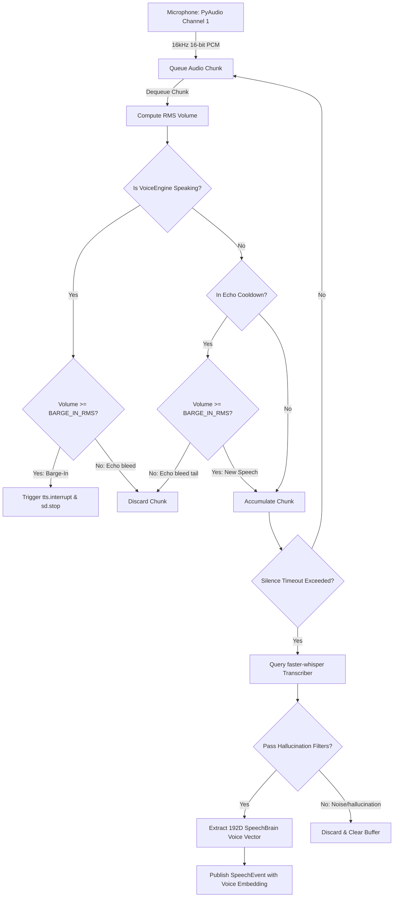
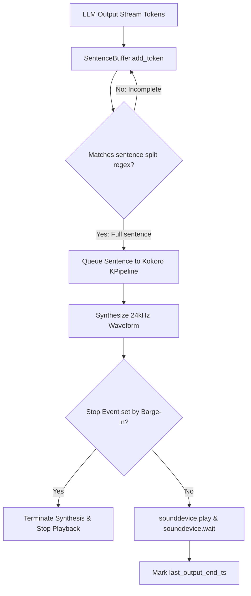

# 🔊 Voice Thesis Report (Chapters 3 & 4)

This document serves as the **Voice Subsystem Report** for the AI Robot System, formatted in accordance with the Graduation Project Thesis Guide guidelines. It details the design, digital signal processing loops, and implementation details of the acoustic pipelines.

---

## 📂 File Structure & Code Map

*   [stt_engine.py](file:///x:/Robot-main/Robot-main/voice/stt_engine.py) — Raw mic capture loops, RMS calculators, and faster-whisper transcribers.
*   [speaker_recognition.py](file:///x:/Robot-main/Robot-main/voice/speaker_recognition.py) — SpeechBrain voice print embedding generator (192D output).
*   [tts_engine.py](file:///x:/Robot-main/Robot-main/voice/tts_engine.py) — Token sentence builders, Kokoro synthesizers, and sounddevice players.

---

## 🎓 Chapter 3: Proposed System and Methodology (Voice)

### 3.1 Voice Architecture & Digital Signal Loop
The audio system runs background capture and processing loops to enable natural, low-latency vocal interactions:



### 3.3 Methodology & Digital Signal Processing (DSP)

#### A. Acoustic & Echo Barge-In Filtering
To allow the user to speak over the robot's responses, the engine tracks the `tts.is_speaking` status.
*   **Barge-In Gate**: If vocal energy (RMS value) exceeds `BARGE_IN_RMS` (default: `0.065`) while the robot is playing audio, the engine calls `tts.interrupt()` to clear playback and flushes the capture buffer.
*   **Echo Cooldown Gate**: Chunks captured during the `POST_TTS_COOLDOWN_SECONDS` window (default: `0.65` seconds) with an RMS below the barge-in limit are discarded to prevent the robot from hearing its own echo tails.

#### B. Whisper Speech-to-Text Pipeline
*   **Acoustic Transcription**: Waveforms are processed via PyAudio's 16kHz sampling using `faster-whisper` (default: `small` model). Injects a localized vocabulary prompt to bias search predictions toward domain terms.
*   **Hallucination Filters**:
    *   **Garbage Cleanups**: Rejects repetitive word sequences.
    *   **Word Length Filter**: Ignores transcriptions under 3 words unless they match explicit confirm/deny keywords (e.g. `hello`, `yes`, `no`, `stop`, `okay`, `i'm [Name]`).
    *   **Confidence Floor**: Rejects segments where the average segment probability falls below `WHISPER_AVG_LOGPROB_MIN` (default: `-0.85`).
    *   **Filler Exclusions**: Purges common hallucinated strings like `"thank you for watching"` or `"subscribe"` caused by ambient hums.

#### C. SpeechBrain Speaker Verification
*   Integrates SpeechBrain's `EncoderClassifier` utilizing the `spkrec-ecapa-voxceleb` model.
*   Extracts a normalized 192-dimensional speaker identity vector from the finalized speech chunk.
*   **Minimum Duration Constraint**: Requires at least `VOICE_EMBEDDING_MIN_SECONDS` (default: `0.75` seconds) of active speech to generate a stable embedding; shorter clips return `None`.

#### D. Kokoro Streaming Text-to-Speech
*   **Streaming & Sentence Buffering**:
    *   Exposes `speak_stream` which takes a token iterator from the LLM engine.
    *   [SentenceBuffer](file:///x:/Robot-main/Robot-main/voice/tts_engine.py#L22) aggregates incoming tokens in real-time. It uses the regex pattern `(.*?[.?!:\n]+)\s*` to split text. Complete sentences are sent to Kokoro's synthesis pipeline as they arrive, reducing latency.



### 3.4 Tools and Technologies (Voice)
*   **STT Framework**: `faster-whisper` (utilizing ctypes/CUDA backend).
*   **TTS Pipeline**: `kokoro` (v0.9+) KPipeline running on CUDA/CPU.
*   **Audio I/O**: PyAudio (mic capture) and Sounddevice/Soundfile (audio output playback).
*   **Feature Extractor**: SpeechBrain ECAPA-TDNN VoxCeleb model.

---

## 🎓 Chapter 4: Implementation (Voice)

### 4.1 Detailed Algorithmic Logic

Here we detail the step-by-step algorithms governing the Voice Module's subsystems.

#### Algorithm 4.13: Always-On Speech Hearing Loop
```
INPUT: PyAudio input streams, EventQueue handler
OUTPUT: Enqueued SpeechEvent objects with 192D voice prints

1. Spawn STT_Listen Thread:
   While self.running is true:
     a. Read chunk (1024 samples) from PyAudio input stream.
     b. Push raw PCM bytes to self._audio_queue.
     
2. Spawn STT_Process Thread:
   Initialize current_audio = empty float32 array.
   Initialize silence_start_time = None, has_speech = False, barge_in_active = False.
   While self.running is true:
     a. Dequeue raw chunk; convert bytes to normalized float32 array (-1.0 to 1.0) = chunk_np.
     b. Compute RMS volume of chunk_np = volume.
     
     c. Check Barge-In or Cooldown Gate:
        i. If tts.is_speaking is true:
             If volume >= BARGE_IN_RMS:
               Call tts.interrupt() and sd.stop() to kill robot speech.
               Set barge_in_active = True, current_audio = empty array, has_speech = False, silence_start_time = None.
             Else:
               Skip chunk (Echo suppression).
               Continue loop.
       ii. If in_cooldown is true and not barge_in_active:
             If volume >= BARGE_IN_RMS:
               Set current_audio = empty array, has_speech = False, silence_start_time = None.
             Else:
               Skip chunk.
               Continue loop.
               
     d. Accumulate audio buffer:
        current_audio = concatenate(current_audio, chunk_np).
        
     e. Check vocal activity parameters:
        If volume >= SILENCE_THRESHOLD (0.02):
          silence_start_time = None, has_speech = True.
          Set speech_activity.mark_speech_chunk().
        Else:
          If silence_start_time is None:
            Set silence_start_time = CurrentTime().
          If not has_speech (suppress leading silence accumulation):
            Keep only last 1.0 second of audio in current_audio.
            
     f. Check split conditions:
        i. If current_audio duration > MAX_CHUNK_DURATION (30.0s) (stitch timeout):
             Let text = Transcribe(current_audio) (using Algorithm 4.14).
             Append text to accumulated_text.
             Clear current_audio, has_speech = False, silence_start_time = None.
             
       ii. If silence_start_time is set and CurrentTime() - silence_start_time > SILENCE_DURATION (0.8s):
             If duration > 1.0s and has_speech is true:
               Let text = Transcribe(current_audio) (using Algorithm 4.14).
               Append text to accumulated_text.
             
             If accumulated_text is not empty:
               a. Run Algorithm 4.8 (Speaker Recognition) on current_audio; returns voice_embedding.
               b. Push SpeechEvent(accumulated_text, voice_embedding) to EventQueue.
             
             Clear current_audio, accumulated_text = "", silence_start_time = None, has_speech = False, barge_in_active = False.
```

#### Algorithm 4.14: Transcription Filtering & Hallucination Suppression
```
INPUT: Audio waveform array
OUTPUT: Transcribed text string (or empty string)

1. Invoke faster-whisper transcriber:
   a. Call WhisperModel.transcribe passing waveform, vad_filter = True, temperature = 0.0, language = WHISPER_LANGUAGE.
   b. Retrieve segments and word statistics.
   c. If segments is empty, return empty string.
   
2. Concatenate segments content to raw_text.
3. If is_repetitive_garbage(raw_text) is true, return empty string.

4. Apply Length and Content Filters:
   a. Split raw_text into list of words.
   b. If size(words) < 3:
        Let text_lower = lower(raw_text) stripped of punctuation.
        If text_lower is in legit_short list (e.g. 'hello', 'hey', 'yes', 'no', 'stop') OR
           text_lower starts with intro prefix (e.g. 'im', 'my name is') OR
           text_lower starts with confirmation prefix (e.g. 'sounds good', 'thats correct'):
             Pass filter.
        Else:
             Return empty string.
             
   c. If text_lower is in filler hallucination list (e.g. 'thank you for watching', 'subscribe', 'thanks'):
        Return empty string.
        
   d. If count(letters in raw_text) < 0.3 * length(raw_text), return empty string (non-alphabetic noise filter).
   
5. Apply Confidence Threshold:
   a. Compute average log probability of segments = avg_logprob.
   b. If avg_logprob < WHISPER_AVG_LOGPROB_MIN (-0.85), return empty string.
   
6. Return raw_text.
```

#### Algorithm 4.15: Streaming TTS Playback
```
INPUT: Token generator stream from LLM engine
OUTPUT: Plays synthesised speech waves

1. Clear stop_event flag; set VoiceEngine.is_speaking = True.
2. Initialize SentenceBuffer.
3. For each token in Token generator stream:
     a. If stop_event.is_set is true, break loop.
     b. Print token to stdout.
     c. Append token to SentenceBuffer.
     d. Parse matches: list_of_sentences = SentenceBuffer.add_token(token).
     e. For each sentence in list_of_sentences:
          If stop_event.is_set is true, break loop.
          Run Algorithm 4.16 (Playback Sentence) passing sentence.
          
4. Flush remaining buffer:
   If stop_event.is_set is false:
     a. Let remaining = SentenceBuffer.flush().
     b. For each sentence in remaining:
          If stop_event.is_set is true, break loop.
          Run Algorithm 4.16 (Playback Sentence) passing sentence.
          
5. Set is_speaking = False.
6. Set last_output_end_ts = CurrentTime().
```

#### Algorithm 4.16: Playback Sentence
```
INPUT: sentence text string
OUTPUT: Audio waveform output played to soundcard

1. If sentence is empty or stop_event is set, return.
2. Feed sentence to Kokoro KPipeline generator.
3. For each batch (audio waveform array) returned by KPipeline:
     a. If stop_event is set:
          Call sounddevice.stop()
          Return.
     b. Call sounddevice.play(audio waveform, sample_rate = 24000).
     c. Call sounddevice.wait() (block until playback completes).
```
